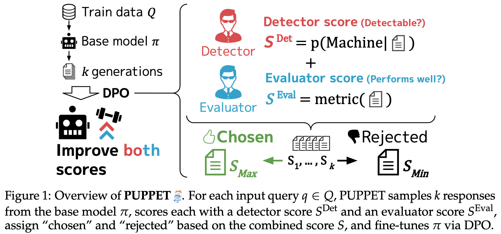
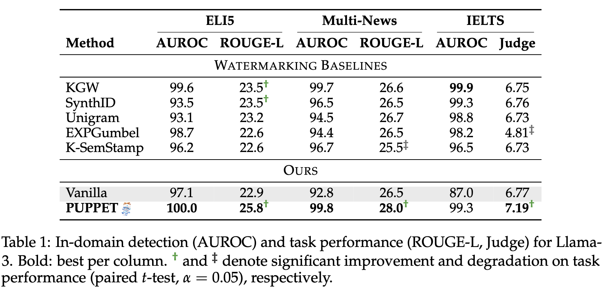
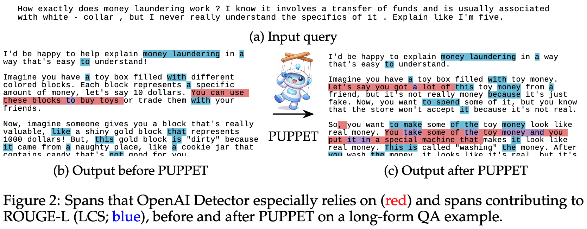

<p align="center">

</p>

<p align="center">
  <a href="https://github.com/pakapaka333/PUPPET?tab=Apache-2.0-1-ov-file"></a>
  <a href="https://arxiv.org/abs/2605.01350"></a>
  <!-- <a href="DATASET_URL"></a> -->
  <a href="https://huggingface.co/collections/aru-pakapaka/puppet"></a>
</p>

<h3 align="center"><i><b>
PUPPET: LLM Output Detectability and Task Performance Can be Jointly Optimized
</b></i></h3>

<p align="center">
PUPPET is a framework that trains an LLM via Direct Preference Optimization (DPO) <br>
to produce texts that are <b>both more detectable and better at downstream tasks</b> — <br>
the first demonstration that detectability and task performance can be jointly optimized.
</p>


<details>
  <summary><strong>Contents</strong></summary>

- [🗞️ News](#️-news)
- [🔍 Overview](#-overview)
- [🔧 Usage](#-usage)
  - [🎬 Hands-on Demo: ELI-5 × Llama-3.1-8B-Instruct](#-hands-on-demo-eli-5--llama-31-8b-instruct)
    - [0. Configure environment variables (Optional)](#0-configure-environment-variables-optional)
    - [1. Install dependencies](#1-install-dependencies)
    - [2. Build the DPO dataset (1 GPU, ~60 min)](#2-build-the-dpo-dataset-1-gpu-60-min)
    - [3. Train the model (2 GPUs, ~70 min)](#3-train-the-model-2-gpus-70-min)
    - [4. Evaluate the trained model (1 GPU)](#4-evaluate-the-trained-model-1-gpu)
  - [🔧 Use PUPPET on your own setup](#-use-puppet-on-your-own-setup)
    - [1. Bring your own dataset](#1-bring-your-own-dataset)
    - [2. Bring your own model and prompt](#2-bring-your-own-model-and-prompt)
  - [🧪 Reproduce the paper experiments](#-reproduce-the-paper-experiments)
- [📝 Citation](#-citation)

</details>


# 🗞️ News

- 2026-05-05: 🎉 We have made our preprint ([paper](https://arxiv.org/abs/2605.01350)) and experimental code publicly available.

# 🔍 Overview

PUPPET samples multiple responses from a base LLM and scores each on two dimensions: **detectability** (probability of Machine class) and **task performance** (ROUGE-L, LLM-as-a-Judge, etc.). The highest- and lowest-scoring responses form a preference pair, and DPO steers the model toward texts that score well on both.

<p align="center">

</p>

PUPPET improves detectability (AUROC) and task performance (ROUGE-L, Judge).
The detectability matches or outperforms all watermarking baselines while surpassing them on task performance across three benchmarks.

<p align="center">

</p>

Token-level behavior using SHAP ([Lundberg & Lee, 2017](https://proceedings.neurips.cc/paper/2017/hash/8a20a8621978632d76c43dfd28b67767-Abstract.html)) for detectability and LCS for task performance (ROUGE-L) provides evidence that PUPPET encourages the LLM to generate text with features that benefit both objectives.

<p align="center">

</p>


# 🔧 Usage

## 🎬 Hands-on Demo: ELI-5 × Llama-3.1-8B-Instruct

The `scripts/` directory contains a minimal, self-contained reproduction of the PUPPET pipeline using **ELI-5** (a long-form QA dataset; [Fan+, 2019](https://aclanthology.org/P19-1346/)) and **Llama-3.1-8B-Instruct** ([Llama Team, 2024](https://arxiv.org/abs/2407.21783)) as the base model.

> **Reference hardware:** NVIDIA RTX A6000 (48 GB VRAM). <br>
> Steps 2 and 4 require **1 GPU** (≥48 GB VRAM); step 3 requires **2 GPUs** (≥48 GB VRAM each).

### 0. Configure environment variables (Optional)

If needed, edit `.env_template` and set any environment variables you want.
After editing it, rename the file to `.env` so the setup script can load it later.
> For example, if you use a model that requires user authentication, you need to set `HF_TOKEN`.

### 1. Install dependencies

```bash
cd scripts/
bash 1_setup_environment/1_setup.sh
```

Runs uv sync for each pipeline stage (`2_build_dataset/`, `3_train_model/`, `4_evaluate_trained_model/`).

### 2. Build the DPO dataset (1 GPU, ~60 min)

```bash
set -a; source .env; set +a
cd 2_build_dataset/

# Download and prepare the base dataset
uv run python 1_get_base_dataset.py --config 1_base_dataset/config.yaml

# Sample multiple responses from the base LLM (~40 min)
CUDA_VISIBLE_DEVICES=0 uv run python 2_sample_llm_responses.py --config 2_llm_responses/config.yaml

# Score responses and construct preference pairs (~20 min)
CUDA_VISIBLE_DEVICES=0 uv run python 3_build_dpo_dataset.py --config 3_dpo_dataset/config.yaml
```

Key settings in the configs:

- `1_base_dataset/config.yaml` — number of training samples (`num_samples`, default 5000)
- `2_llm_responses/config.yaml` — prompt, model, sampling parameters (`n`, token limits)
- `3_dpo_dataset/config.yaml` — score weights and pairing strategy

### 3. Train the model (2 GPUs, ~70 min)

```bash
cd ../3_train_model/
CUDA_VISIBLE_DEVICES=0,1 uv run python 1_train_model.py --config 1_train_model/config.yaml
```

Key settings in `1_train_model/config.yaml`:

- `model.name` — base model (default `meta-llama/Llama-3.1-8B-Instruct`)
- `training.use_lora` — LoRA fine-tuning (default `true`)
- `training.dpo_kwargs` — learning rate, beta, epochs, batch size

Checkpoints are saved to `3_train_model/1_train_model/checkpoints/`.

### 4. Evaluate the trained model (1 GPU)

```bash
cd ../4_evaluate_trained_model/

# Prepare a test set (no GPU needed)
uv run python 1_setup.py --config 1_setup/config.yaml

# Generate responses from base and trained models (~5 min per model)
CUDA_VISIBLE_DEVICES=0 uv run python 2_sample_llm_responses.py --config 2_llm_responses/config.yaml

# Compute metrics and print comparison table
CUDA_VISIBLE_DEVICES=0 uv run python 3_evaluate.py --config 3_evaluate/config.yaml
```

Expected output:

```
=====================================================================
Metric                                 base    trained              Δ
---------------------------------------------------------------------
Rouge-L                              0.2135     0.2389        +0.0254
OpenAI detector AUROC                0.8711     0.9995        +0.1284
OpenAI detector TPR@1%FPR            0.4487     0.9933        +0.5447
=====================================================================
```

> The above results are from my actual run, demonstrating that PUPPET is working as intended!

---

## 🔧 Use PUPPET on your own setup

You can apply PUPPET to any model and dataset by changing only the following two points.

### 1. Bring your own dataset

Implement your dataset construction logic in `scripts/2_build_dataset/1_get_base_dataset.py` by editing the `build_dataset()` function:

```python
# scripts/2_build_dataset/1_get_base_dataset.py

def build_dataset(seed, num_samples, start_index):
    # Replace this with your own dataset construction logic.
    # The returned Dataset must contain these columns:
    #   input   (str)       – question / prompt text
    #   context (str)       – additional context (empty string if none)
    #   outputs (list[str]) – human-written reference answers (used for AUROC computation)
    return build_eli5_dataset(seed=seed, num_samples=num_samples, start_index=start_index)
```

`build_dataset()` is automatically reused for both the training split (step 2) and the evaluation split (step 4), so no other script changes are needed.

### 2. Bring your own model and prompt

Edit the config files to point to your model and adjust the prompt template:

| Config | What to change |
|---|---|
| `2_build_dataset/2_llm_responses/config.yaml` | `model.name`, `prompt_template` |
| `3_train_model/1_train_model/config.yaml` | `model.name`, `training.dpo_kwargs` |
| `4_evaluate_trained_model/2_llm_responses/config.yaml` | `models.base.name`, `models.trained.path`, `prompt_template` |

Everything else — scoring, DPO pair construction, training, and evaluation — works without modification.

---

## 🧪 Reproduce the paper experiments

The code used in the paper lives in [experimental/](experimental/)
See [experimental/README.md](experimental/README.md) for the full setup and usage instructions.

# ✒️ Citation

If you find our code or work helpful, please cite:

```bibtex
@misc{Saito:PUPPET:2026,
  author        = {Koshiro Saito and Ryuto Koike and Masahiro Kaneko and Naoaki Okazaki},
  title         = {{LLM} Output Detectability and Task Performance Can be Jointly Optimized},
  eprint        = {2605.01350},
  howpublished  = {arXiv:2605.01350},
  primaryClass  = {cs.CL},
  year          = {2026},
}
```

